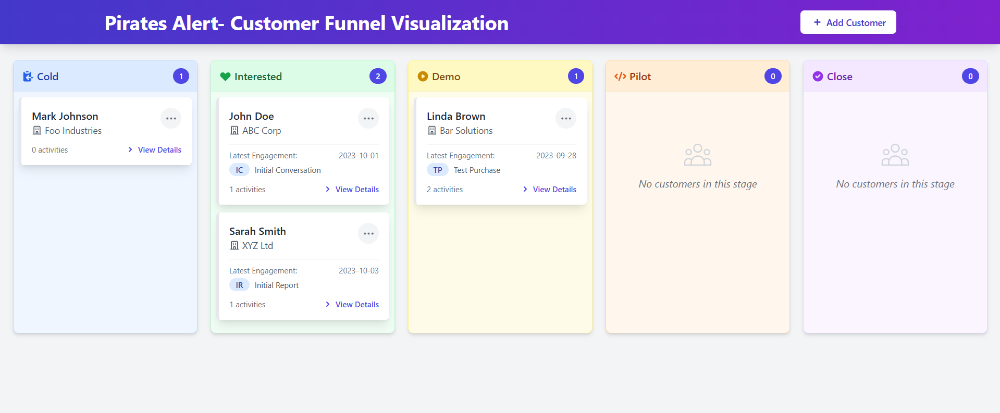

# Customer Funnel Management Tool

A ReactJs application for visualizing and managing customer sales funnel stages. This tool helps track customers' progress through the sales pipeline and manage engagement activities.

## Features

- Visual Kanban-style board with drag-and-drop functionality
- Customer progress tracking through predefined stages: Cold → Interested → Demo → Pilot → Close
- Engagement activity assignment
- Detailed customer history
- Interactive and responsive UI

## Technology Stack

- React
- Tailwind CSS
- React DnD (drag and drop)
- Vite

## Getting Started

1. Clone the repository
2. Install dependencies: `npm install`
3. Start development server: `npm run dev`

## Usage

- Drag customers between adjacent stages
- Click on a customer to view detailed information
- Assign engagement activities to move customers to the next stage
- Each engagement can be used only once per customer
